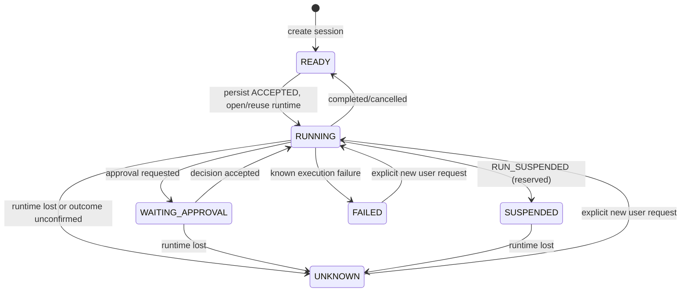
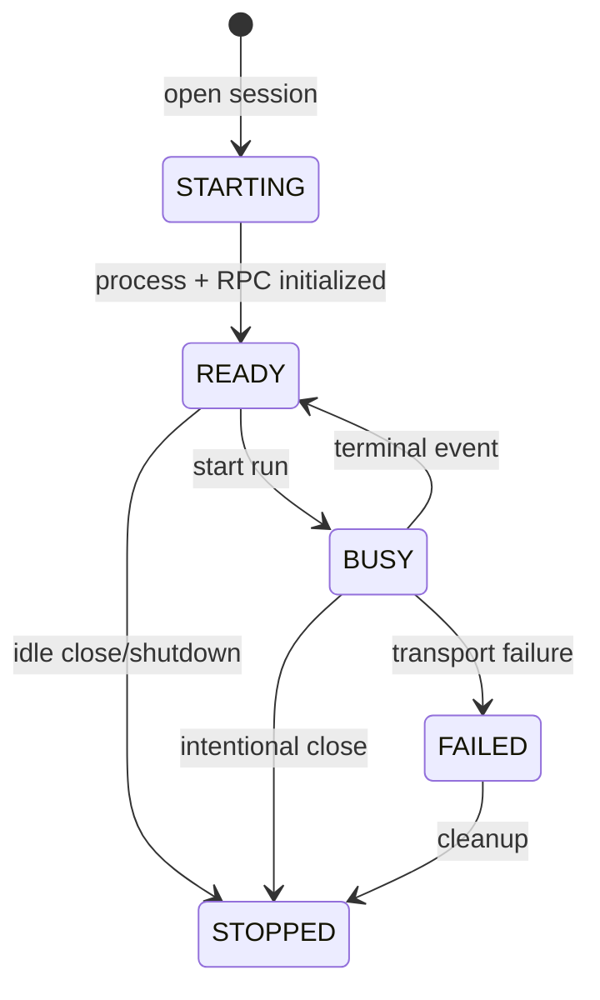

# Pi Agent v2 生命周期管理

本文定义 Agent v2 的生命周期边界。V1 不使用这套状态机、运行时句柄、Pi 进程、票据和事件恢复逻辑。

## 状态权威

持久化状态由三层组成：

1. `AgentRun` 是一次用户请求的最终业务状态。
2. `AgentSession` 是会话当前是否允许继续发送的状态。
3. `AgentEvent` 是按序追加的业务事实流，用于页面恢复和审计。Pi 模型上下文通过 Pi session log 和 resume reference 恢复。

Pi 进程、RPC、模型票据和工具票据都是运行时资源，不是业务状态。它们丢失时只能推动业务状态进入 `UNKNOWN`，不能把运行时资源状态当成成功或失败结果。

## 业务状态机



`AgentRun` 的终态是 `COMPLETED`、`FAILED`、`CANCELLED`、`UNKNOWN`。终态之后的迟到 Pi 事件必须丢弃，不能改变运行记录或会话状态。

`SUSPENDED` 是已定义的非终态，支持继续观察、取消和运行时丢失后的恢复处理。当前 Pi 转换器不产生 `RUN_SUSPENDED`，也没有挂起后恢复运行的接口或 `SUSPENDED -> RUNNING` 转换，不能据此宣称已实现暂停与继续功能。

`UNKNOWN` 表示副作用是否发生无法确认。系统不得自动重放原请求；只有用户显式发起下一次请求，才创建新的 run。

## 运行时资源状态



handle 关闭时遵循以下边界：

1. 标记 handle 不再接受新运行。
2. 对活动 run 发出 `RUN_OUTCOME_UNKNOWN`，先完成业务事件回调，再完成 handle 的 termination 通知。
3. 结束 Pi 进程、关闭 RPC 并使 pending 请求失败，关闭模型配置并撤销模型、工具票据；关闭链使用 `finally` 继续清理其余资源。

handle registry 的显式关闭和 termination 回调都可能先移除注册项，再调用 handle.close；进程 supervisor 也会在 process exit 时移除记录。注册项移除并非固定发生在物理资源清理之后，移除和关闭必须幂等。

问题和审批等待循环每 200ms 检查 run 是否仍活动，终态后退出等待并收敛；取消和孤儿恢复还会显式取消问题。它们并非 handle 关闭步骤内同步统一取消。

终止通知必须只执行一次，并且业务事件回调不能持有 handle 锁，以免和 Coordinator 形成反向锁等待。

## 一次运行的顺序

```text
HTTP start
  -> Coordinator 恢复孤儿状态
  -> 检查幂等键
  -> 创建 ACCEPTED run
  -> 追加 RUN_ACCEPTED
  -> 更新 session=RUNNING
  -> 取得或创建 session handle
  -> 刷新模型/工具票据并原子发布配置
  -> Pi refresh-model + catalog 握手
  -> set_model
  -> prompt
  -> handle 转换 Pi 事件；终态事件先释放内存中的活动 run
  -> Pi 事件按顺序进入 Coordinator
  -> 追加业务事件并 CAS 更新 run/session
```

模型和工具票据按每次 run 刷新。配置文件必须临时写入并原子替换；Pi 启动阶段不应使用旧票据发起 catalog 请求。

## 恢复规则

所有会话读取、事件轮询、发送、取消和删除入口都先调用同一个恢复函数：

1. 如果 handle 健康，直接使用当前状态。
2. 如果 handle 已终止或不存在，读取全部 run 记录和事件尾部。
3. 先把事件 watermark 追到实际尾部，避免分开写入造成重复 sequence。
4. 所有非终态 run 收敛为 `UNKNOWN`。
5. 按最新 `firstEventSequence + runId` 校准 session 状态。
6. 不重新执行原模型请求、工具调用、SQL 或 shell 命令。

恢复必须覆盖这些崩溃窗口：`ACCEPTED` 已写但 session 未更新、事件已写但 run snapshot 未更新、run 已终态但 session 仍为 RUNNING、旧孤儿 run 与新终态 run 同时存在。

## 前端观察

前端只把持久化终态事件作为结束条件。事件 GET 超时或瞬时失败时：

- 保留当前 run、审批和问题；
- 使用原 `afterSequence` 退避重连；
- 丢弃迟到响应和已切换会话的响应；
- 收到 `RUN_OUTCOME_UNKNOWN`、`RUN_COMPLETED`、`RUN_FAILED` 或 `RUN_CANCELLED` 后结束观察。

历史加载和 URL 首次恢复先使用会话列表中的版本；列表不可用或未找到会话时，再单独探测 V2 session。探测成功按 V2 加载；探测失败仍回退 V1，因此列表与 V2 探测同时失败时仍存在误降级边界。

## 资源回收策略

- Pi 进程退出由 RPC termination 和 process exit 双重观察，但业务结算只允许一次。
- 空闲句柄可以在新的运行时打开前回收；回收只能针对没有活动 run 的 session。
- 票据过期只触发下一次显式 run 的刷新，不自动重放旧 run。
- 删除 session 前先恢复并确认没有活动 run；删除后迟到事件只记录丢弃原因，不让 RPC reader 失败。
- 删除并重建同名 session 时，事件 watermark 必须从磁盘重新计算。

## 当前实现与剩余边界

当前代码和测试已经覆盖 termination 顺序、锁竞争、事件分页、幂等、空闲复用、Pi 进程退出、后端重启和票据过期。仍需持续关注：

- Pi 原始事件没有稳定 runId 时，跨 run 的迟到事件只能依赖单线程事件顺序；若 Pi 协议提供 run/message 标识，应在转换层强校验。
- 真实浏览器休眠、网络恢复和 UI 审批闭环还需要在独立测试服务上补验。
- 空闲进程的具体回收时间应作为配置策略明确化，不能由业务状态推测。
